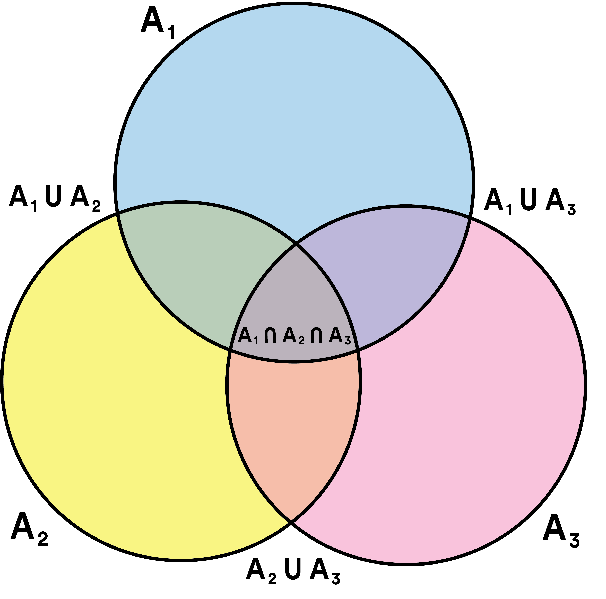

```{r setup, include=FALSE}
knitr::opts_chunk$set(echo = TRUE)
library(knitr)
library(png)
```

## Question 1

#### Part A

Dividing 12 people into 2 groups is unordered sampling without replacment, requiring n choose k, divided by two to avoid complement groups. 

$Combinations = \frac{1}{2} C_{6, 12} = \frac{1}{2}\binom{12}{6} = \frac{1}{2} \cdot \frac{n!}{k!(n-k)!} = \frac{1}{2} \cdot \frac{12!}{6!(6)!} = 462$

#### Part B

Dividing 12 people into 3 groups is again unordered sampling without replacement, requring n choose k, divided by the number of group complements, 3!. 

$Combinations = \frac{1}{3!} C_{4, 12} C_{4, 8} = \frac{1}{3!} \binom{12}{4} \binom{8}{4}= = \frac{1}{3!} \cdot \frac{12!}{4!(8)!} \frac{8!}{4!(4)!}= 5775$

#### Part C

Dividing 12 people into 2 groups of any size requires looking only at half of the group sizes since they are doubled, and accounting for the reversibility of 2 groups of 6.

$Combinations = \binom{12}{12} + \binom{12}{11} + \binom{12}{10} + \binom{12}{9} + \binom{12}{8} + \binom{12}{7} + \frac{1}{2}\binom{12}{6}$

## Question 2

#### Part A

Alice, by computing $\binom{8}{3} \binom{5}{2} \cdot 3! = 3360$, is likely breaking the 8 slots by the types of letters that can be chosen. First she finds the number of ways to fill 3 of the 8 slots with E's. Then the number of ways to fill 2 slots with N's, and finally the last 3 slots with the 3 unique letters left. 

#### Part B

Bob likely first assigned a letter to each of the 8 spots. He then divided by 3! to acccount for all E's being the same, and again by 2 to account for all N's being the same.

#### Part C

Here, the arrangements must be divided by 8 to account for the rotation of the letters in a circle, one by one for each letter. 

$Arrangements = \frac{1}{8} \binom{8}{3} \binom{5}{2} 3! = 420$ 

## Question 3

#### Part A

The number of 4 person teams that can be made from 36 MEng students is based on unordered sampling without replacement. Thus $C_{4,36} = \binom{n}{k} = \binom{36}{4} = \frac{36!}{4! \cdot 32!} = 58905$ so there are a total of 58905 possible teams.

#### Part B

Finding the numbere of possible 4 person teams consisting of 2 men and 2 women when there are 16 men and 20 women involves unordered sampling without replacement of gender pairs and the multiplication rule for making full teams. Thus the ways to make pairs of men is $C_{2,16} = \binom{n}{k} = \binom{16}{2} = \frac{16!}{2! \cdot 14!} = 120$ while the ways to make pairs of women is $C_{2,20} = \binom{n}{k} = \binom{20}{2} = \frac{20!}{2! \cdot 18!} = 190$. The ways to make teams of 4 incorporating 2 men and 2 women involves multiplying the possibilities of pairs of men and women, $C_{2,20} \cdot C_{2,16} = 120 \cdot 190 = 22800$, so there are a total of 22800 teams possible.

## Question 4

#### Part A

```{r  out.width = "50%"}
 
```

#### Part B

$1 - P(A_1) = 1 - .24 = .76$

#### Part C

$P(A_1 \cap A_2) = P(A_1)P(A_2)  = .24 \cdot .18 = .0432$

#### Part D

$P((A_1 \cap A_2) \cap  A_3^c) = P(A_1 \cap A_2) \cdot (1 - P(A_3)) = .0432 \cdot (1 - .1) = .0432 \cdot .9 = .0389$

$P(A_1 \cap A_2) - P(A_1 \cap A_2 \cap A_3) = .0432 - .02 = .0232$

#### Part E

$P(A_1 \cap A_2 \cap A_3)^c = 1 - (P(A_1) \cdot P(A_2) \cdot P(A_3)) = 1 - (.24) (.18) (.1) = .98$

## Question 5

#### Part A

- All 3 elevators are down is given by $A \cap B \cap C$

- Only elevator A is down is given by $A \cap B^c \cap C^c$

- None of the elevators are down is given by $(A \cap B \cap C)^c$

- At least one elevator is down is given by $A \cup B \cup C$

- Exactly one elevator is down is given by $(A \cap B^c \cap C^c) \cup (B \cap A^c \cap C^c) \cup (C \cap B^c \cap A^c)$

#### Part B

The max of $P(A \cup B \cup C)$ is the sum of probabilities, $P = 35 + 30 + 10 = 75\%$, while the min is the lowest probability that encompasses all events, in this case $35\%$.

#### Part C

$P(A \cap B) = .2$, $P(A \cup B) = P(A) + P(B) - P(A \cap B)$ so $P(A \cup B) = .35 + .3 - .2 = \text{.45 or 45%}$.

#### Part D

Based on $P(A \cup B) = .45$, $P(A|B) = \frac{P(A \cap B)}{P(B)} = \frac{.2}{.3} = .667$.  

## Question 6

Number of ways to assign 15 pumps to 8 tanks, where $d(k,n)$ is the number of ways to assign k pumps to n tanks. 

#### Part A

$d(k,n) = 0$ for $n > k \geq 1$ since if the number of tanks is greater than the number of pumps, not every tank will recive a pump, which violates the goal of each thank receiving at least one pump.

#### Part B

$d(k,k) = k!$ for all $k \geq 1$ since once a pump is assigned to a tank, the number of possibilities is then k-1, and once a second is assigned the number of possibilities becomes k-2. As this progresses, where a pump is assigned one at a time, the number of possible assignments decreases by one, creating a factorial starting at k, thus k! arrangements.

#### Part C

$d(k,1) = 2^k - 1$ for all $k \geq 1$ since with just a single tank, anywhere from just one of the k pumps to all of the k pumps can be assigned, which amounts to ordered sampling with replacment without assignment of 0 pumps. This is because any combination of pumps can be assigned, where the number of combinations is $n^k$ except the case where none are assigned is not possible so one combination must be remove from the total. 

#### Part D

For $k > 1$ and $n \geq 1$, $d(k, n) = \sum\limits_{j=1}^{k-(n-1)} \binom{k}{j} d(k-j, n-1)$.

This is because when assigning pumps to tanks any number great than 1 can be assigned, so it must be calculated by looking at the arrangments of assigning anywhere from 1 to j pumps to a tank, and then continuing the calculation for each tank, in the end looking at every number of pumps assigned to each tank. In this way, numerous scenarios must be summed for the total since 1 pump could be assigned to the first tank, or $j-n$ pumps, or any number in between, each scenario of which affecting he pumps assigned to subsequent tanks. 

#### Part E

```{r}
#find assignments of k pumps to n tanks

recursivePump <- function(k, n) {
  if ((k <= n) && (k >= 1)) {
    return(0)
  } else if (k == n) {
      return(factorial(k)) 
  } else if (n == 1) {
      return(2^k-1)
  }
  else {
    sum <- 0
    for(j in 1:(k-n+1)) {
      sum = sum + choose(k, j) * recursivePump(k-j, n-1)
      j = j + 1
    }
    return(sum)
  }
}
```

#### Part F

```{r}
assignments <- recursivePump(15, 8)

processTime <- assignments / 1000000 / 60 / 60 / 24 / 365
```

It would take .931 years to analyze all of the possible assignments of pumps to tanks. 